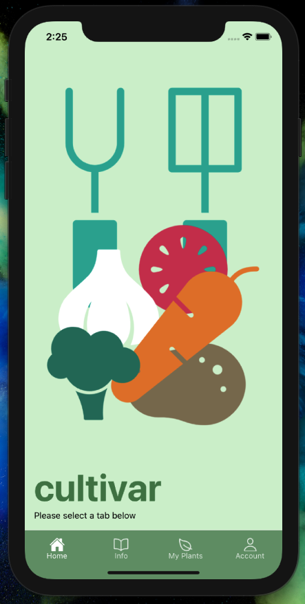

# cultivar - a work in progress
ReactNative app for aspiring garden enthusiasts and dirt friends

## wireframes

# Resources
- Whimsical - https://whimsical.com/
- React File Architecture - https://www.taniarascia.com/react-architecture-directory-structure/
- Setting up eslint - https://medium.com/swlh/add-eslint-support-to-your-react-native-project-with-react-hooks-1bbac3fac25d
- Solve alias module imports - https://raulmelo.dev/blog/module-resolution-or-import-alias-the-final-guide
- Sample Vegetable Data - https://www.almanac.com/vegetable-growing-guide
